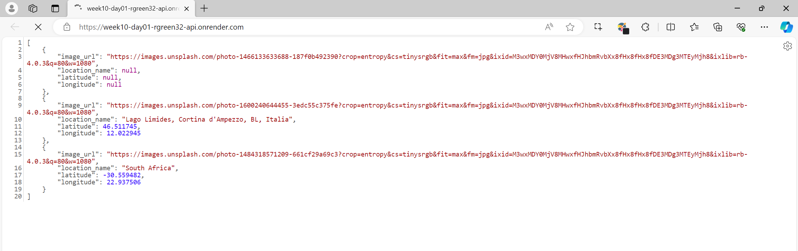
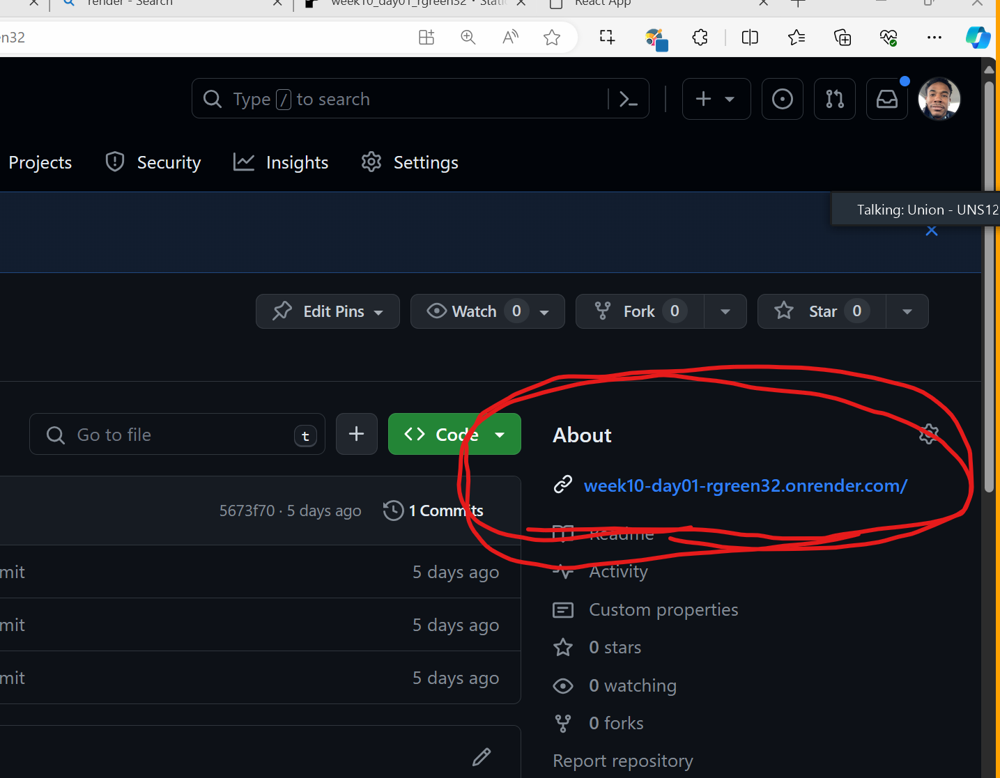
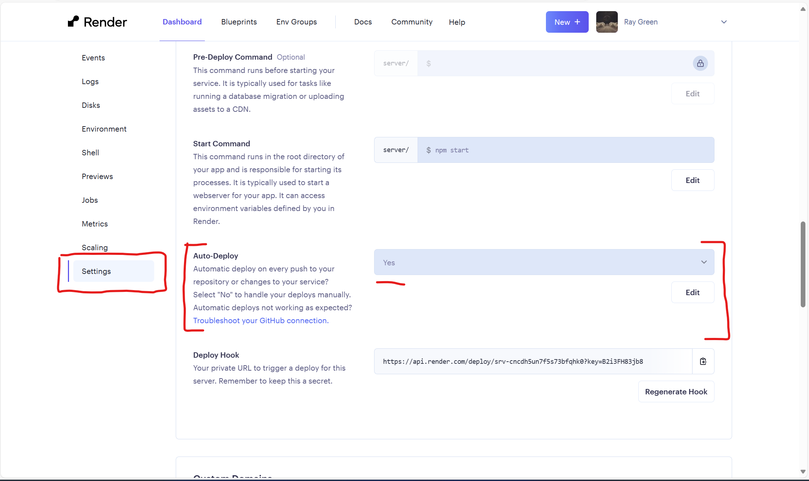
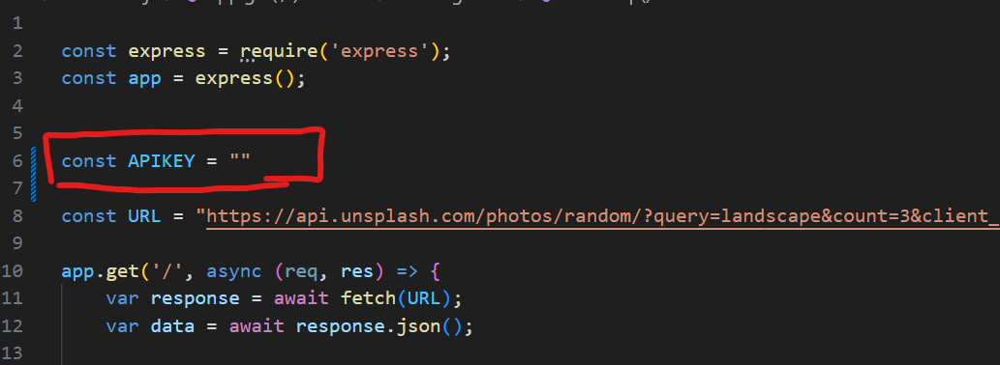
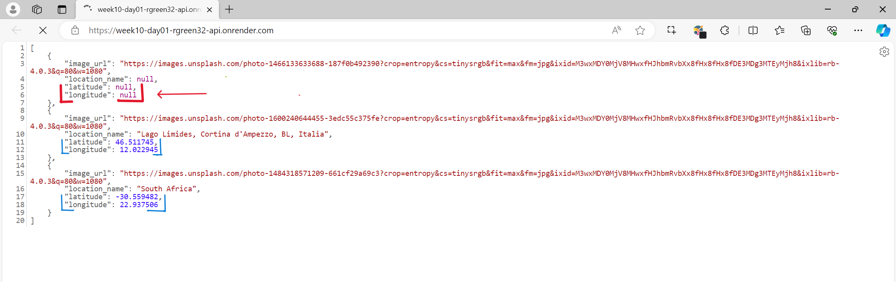

# Hosting and Deployment

## Assignment: Worldview (Client + API)

#### Overview
You will deploy a web application called WorldView to the public internet. This web application is split into two seperate pieces; A client/User Interface and a Rest API. Youll be deploying both of them independently of each other.

  

    <h1 style="margin-right: 1%; margin-top: 1%; text-align: center; margin-bottom: 0px;" >Part 1: Client</h1>
    

    
   <h1 style="margin-right: 1%; margin-top: 5%; text-align:center" >Part 2: Api</h1>
   
  

### Instructions

### **Part 1: Deploy Worldview Client**
1. Deploy the Worldview client to [render](https://render.com/)
   
    
   
2. 

    
Place the url to the deployed client in the description section of the github repo for this assignment

     
      
    

    

3. 

        
Ensure the Client is configured to re-deploy automatically when a new commit is made to the repo for this assignment

         
          
      

### **Part 2: Deploy WorldView API**

1. Configure the WorldView API to use a personal api-key to the [unsplash API](https://unsplash.com/documentation#get-a-random-photo)

       

     - Sign up for a developer account on [unsplash.com](https://unsplash.com/developers)
      
       

     - 

        
Generate an api-key for this application and assign it as a string to the variable declared on line 6 in server.js

         
          
      

      
       

2. Deploy the WorldView API to [render](https://render.com/)

 

3. 

        
Ensure the API is configured to re-deploy automatically when a new commit is made to the repo for this assignment

         
          
      

 

### **Part 3: WorldView API (Filter the nulls)**

1.  

        
Some of the image objects returned from the unsplashed api do not contain latitude/longitude values. Configure the route in server.js to only return image objects with both a latitude and longitude value 

         
          
      

       
      
      - **if** an image is missing either latitude value **or** a longitude value, ensure it is not included in the response data

 

### **Part 4: User Stories**
